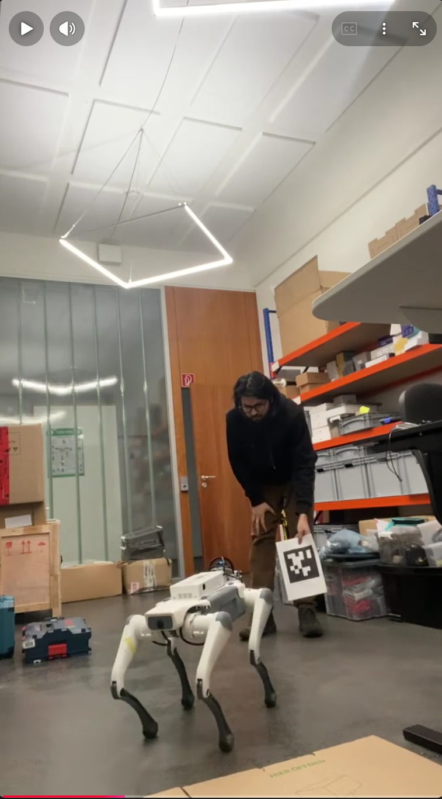
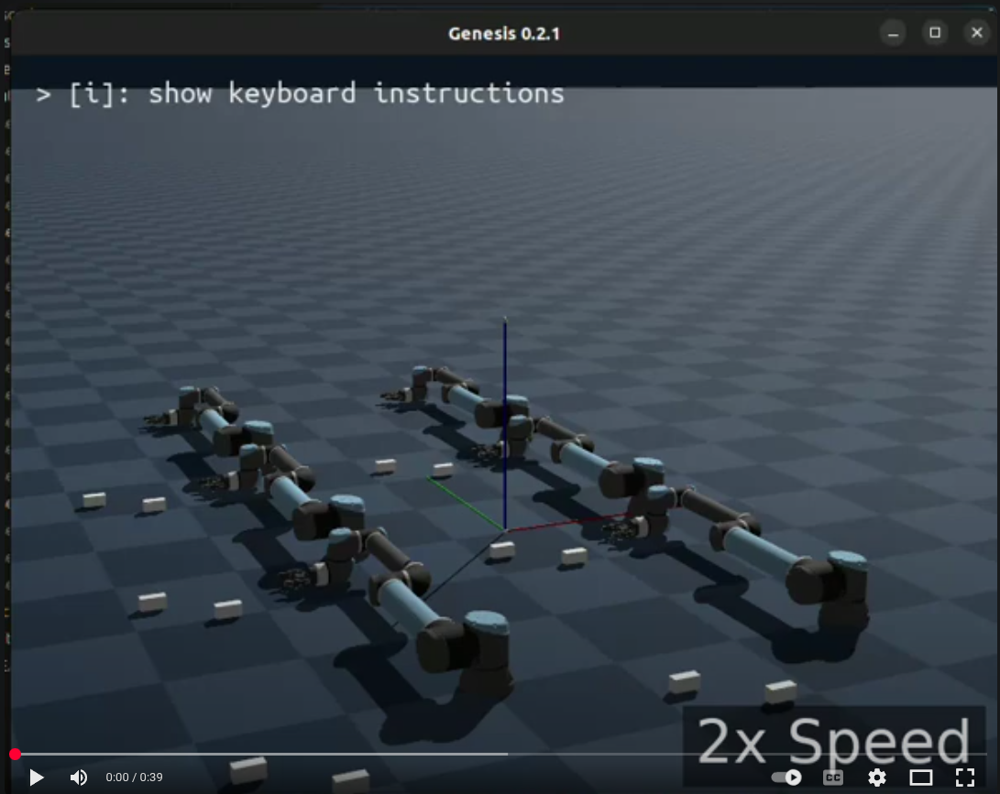

# 👋 Hi, I'm Raihan Kabir Ratul

Generalist AI Robotics Engineer with 5.5+ years of experience with 4+ years in leveraging AI for autonomous shuttles and quadrupeds. From concept to deployment through simulation, I’ve worked on full-robot-software-stack for real-time perception, localization and safety-critical planning and a bit on the Hardware side. Here are some of the projects I've worked:

---

### 🎯 [AprilTag-Based Autonomous Following on Deep Robotics Lite3 Quadruped]()
Developed a real-time visual tracking and following system for the Lite3 quadruped robot using AprilTag fiducial markers. Implemented camera-based tag detection and relative pose estimation to enable autonomous target following and dynamic motion control as a rapid weekend robotics prototype.

**Result:**  

---

### 🎯 [Creating custom LeRobot data from Carla data and training using Smolvla](https://github.com/ratulKabir/lerobot/blob/main/README_CARLA.md)
Creating the LeRobot dataset using monocular camera images and ground truth measurements, and training SmolVLA on the created dataset.

**Result:**  

---

### 🔍 [Generate Rerun dataset using UR10e-Robotiq using Genesis-Sim](https://github.com/ratulKabir/Generate-rerun-dataset-from-UR10e-Robotiq-using-Genesis-Sim)
robotics simulation project that generates multimodal manipulation datasets using a UR10e robot arm with a Robotiq gripper inside the Genesis Simulator. The pipeline supports parallel simulation, trajectory generation, and integration with Rerun for visualization and dataset logging, making it useful for robot learning and embodied AI workflows.

**Result:**  

---

### 🚗 [Reinforcement Learning in CARLA](https://github.com/ratulKabir/carla_rl/tree/folder_refactor)
Trained an RL agent in the CARLA simulator to navigate realistic driving environments. Focused on behavior learning from traffic scenarios.

**Result:**  
%20(1).gif)

---

### 📦 [Custom Object Detection with Darkflow](https://github.com/ratulKabir/Custom-Object-Detection-using-Darkflow)
Trained a YOLOv2 model using Darkflow for detecting custom objects in video streams. Great for rapid prototyping of object detection systems.

**Result:**  

---

🔗 Check out my other repositories for more work, or connect with me on [LinkedIn](https://www.linkedin.com/in/ratulkabir/)!
